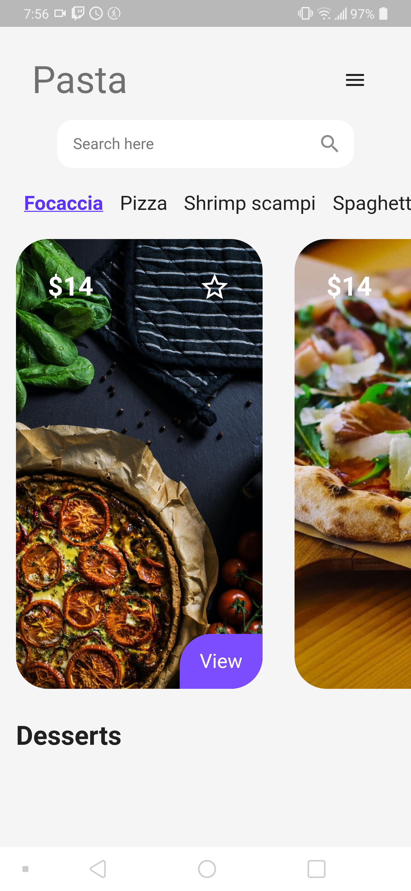

# Pasta UI

A Flutter-based UI for showing some nice pasta. Based on a [UI I found on
 Dribbble](https://dribbble.com/shots/11302823-Food-Screens).

## What I learned:

 - Flutter routing + navigation
 - Adding resources
 - A ton of Flutter UI stuff: Icons, Containers, Decorations of all sorts, 
   scrollable views, views based on aspect ratios, inputs, how to align 
   views/text, 

